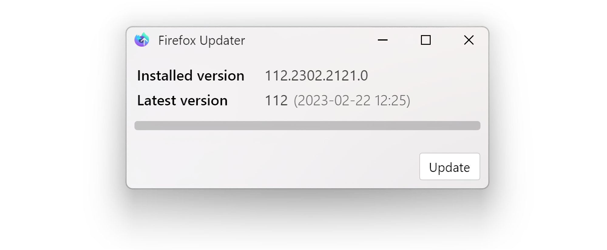

<h1 align="center">Firefox Nightly Updater (MSIX)</h1>  
   

> Update MSIX Firefox Nightly installation by **OneClick**
>
> *
Powered by .NET 8 and Avalonia UI
*

---   

### What's this?
Firefox Nightly is the latest preview version of Firefox, updated twice a day. It's so fresh, so good for developers and hardcore users.  
But unfortunately, it's MSIX package release does not provide automatic updates, nor manual update via the about page.

This tool was designed for users who use MSIX package version of Firefox Nightly occasionally and feel tired of manually downloading and installing the package.

### Screenshot

### Download
- Download pre-built binary from **[Release](releases)**

### System requirements
- Windows 10 x64, version 1709 and later
- Network connection
- .NET Runtime is **NOT** required

--- 

### Limits
- You need run it manually
- It cannot tell you that you have installed the latest version
- It may brick due future download page updates

### Roadmap
- [ ] Download latest version at background after launched browser
- [ ] Automatically update (You might want normal version of Firefox instead of this ?!)
- [ ] Detect accurate version number of latest release
- [ ] Reduce binary size